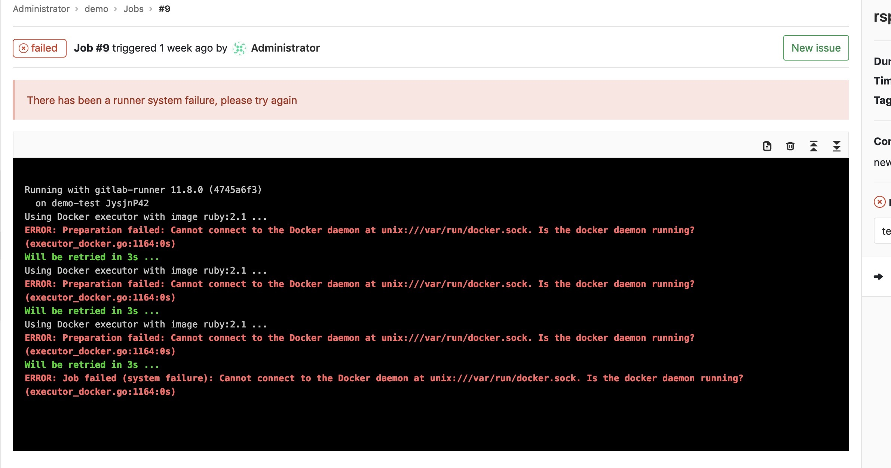
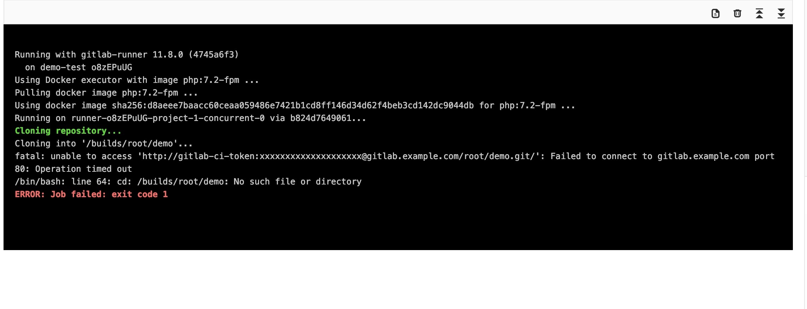

如何通过Gitlab来实现我们项目的自动化部署和持续集成
本文前提依旧是通过docker来安装
<!-- more -->

##  什么是CI/CD

### Ci: 持续集成（CONTINUOUS INTEGRATION）

    在CI环境中，开发人员将会频繁地向主干提交代码。这些新提交的代码在最终合并到主干前，需要经过编译和自动化测试流进行验证。

### CD: 持续部署（CONTINUOUS DEPLOYMENT）

    在CD环境中，通过自动化的构建、测试和部署循环来快速交付高质量的产品。某种程度上代表了一个开发团队工程化的程度，任何修改通过了所有已有的工作流就会直接和客户见面，只有当一个修改在工作流中构建失败才能阻止它部署到产品线。
        
## Gitlab

Gitlab本身就集成了CI/CD,那么我们应该如何使用去使用CI/CD?

### 准备

####    CPU需求
````
1 核心CPU最多支持100个用户，所有的workers和后台任务都在同一个核心工作这将导致GitLab服务响应会有点缓慢。
2核心 支持500用户，这也是官方推荐的最低标准。
4 核心支持2,000用户。
8 核心支持5,000用户。
16 核心支持10,000用户。
32 核心支持20,000用户。
64 核心支持40,000用户。
如果想支持更多用户，可以使用 集群式架构
````
####    运行内存需求
````
1GB 物理内存 + 3GB 交换分区 是最低的要求，但我们 强烈反对 使用这样的配置。 
2GB 物理内存 + 2GB 交换分区 支持100用户，但服务响应会很慢。
4GB 物理内存 支持100用户，也是 官方推荐 的配置。
8GB 物理内存 支持 1,000 用户。
16GB 物理内存 支持 2,000 用户。
32GB 物理内存 支持 4,000 用户。
64GB 物理内存 支持 8,000 用户。
128GB 物理内存 支持 16,000 用户。
256GB 物理内存 支持 32,000 用户。
如果想支持更多用户，可以使用 集群式架构
````

### 安装

````
docker run --detach \
--hostname gitlab.example.com \
--publish 443:443 --publish 8090:80 --publish 8022:22 \ //端口可自定义
--name gitlab \
--restart always \
--volume `pwd`/config:/etc/gitlab \
--volume `pwd`/logs:/var/log/gitlab \
--volume `pwd`/data:/var/opt/gitlab \
--network demo \
gitlab/gitlab-ce:latest
````
### 修改配置

````
cd path/config
vim gitlab.rb

external_url 'http://ip' //如果是https则需要ssl证书,详细可咨询官网
gitlab_rails['gitlab_ssh_host'] = 'git@ip'
gitlab_rails['gitlab_default_projects_features_builds'] = flase
gitlab_rails['gitlab_shell_ssh_port'] = 8022
gitlab_rails['gitlab_port']  = 8022
````
run起来，打开浏览器ip:8090即可当问gitlab，第一次需要设定root密码

### Gitlab-runner
Gitlab-runner 是CI必须要用到的

####    安装

官网不建议将gitlab-runner和gitlab安装在同一个宿主机上面

````
docker run \
-d \
--name gitlab-runner \
--restart always \
-v `pwd`/config:/etc/gitlab-runner:Z \
-v /var/run/docker.sock:/var/run/docker.sock \ //这一行千万不可以乱改，必须和你的docker.sock路径保持一致,出现下列错误信息为本行原因
--network elliot-ngok \
gitlab/gitlab-runner:latest
````

run运行起来
#### 错误信息

上述run的docker.sock路径不正确引发的错误



####    注册runner

[官方文档](https://docs.gitlab.com.cn/runner/register/index.html)

gitlab的实例URL以及token一般在https://ip/root/projects/settings/ci_cd

````
docker注册
1、运行
docker run --rm -t -i -v /path/to/config:/etc/gitlab-runner --name gitlab-runner gitlab/gitlab-runner register
2、输入 GitLab 实例 URL:
Please enter the gitlab-ci coordinator URL (e.g. https://gitlab.com )
3、输入获取到的用于注册 Runner 的 token:
Please enter the gitlab-ci token for this runner
4、输入该 Runner 的描述，稍后也可通过 GitLab's UI 修改:
Please enter the gitlab-ci description for this runner
5、给该 Runner 指派 tags, 稍后也可以在 GitLab's UI 修改:
Please enter the gitlab-ci tags for this runner (comma separated):
6、选择以什么方式执行
Please enter the executor: ssh, docker+machine, docker-ssh+machine, kubernetes, docker, parallels, virtualbox, docker-ssh, shell:
docker
7、如果你选择 Docker 作为你的 executor，注册程序会让你设置一个默认的镜像， 作用于 .gitlab-ci.yml 中未指定镜像的项目：
````

####    注册完后需要修改下配置

vim path/config/config.toml

以下是我的config.toml
````
[[runners]]
  name = "demo-test"
  url = "http://ip:8090/"
  token = "o8zEPuUGRsNPekiF4m68"
  executor = "docker"
  clone_url = "http://ip:8090" //如果没有这一行会报错 Failed to connect to gitlab.example.com port 80
  [runners.docker]
    tls_verify = false
    image = "docker:laster"
    privileged = false
    disable_entrypoint_overwrite = false
    oom_kill_disable = false
    disable_cache = false
    volumes = ["/mydata/deploy/projects:/cache:rw"] //挂在路径
    shm_size = 0
  [runners.cache]
    [runners.cache.s3]
    [runners.cache.gcs]

````
不要忘记重启gitlab-runner容器

####    错误信息
上述信息未配置clone_url引发的信息

### 后续

进入你的projects,在根目录下创建.gitlab-ci.yml文件,文本规则详见[官网文档](https://docs.gitlab.com.cn/ee/ci/yaml/README.html)


