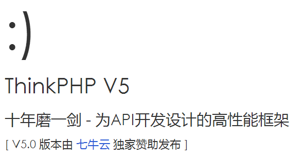

我公司现在所用ThinkPHP5框架(一下简称tp5)，tp5从2016年中秋发布至今，已经有了很多的版本，每一个版本都会有不同的内容更新，本文讲解tp5配置及目录介绍

<!-- more -->

##	官网

http://www.thinkphp.cn/

##	tp5手册

https://www.kancloud.cn/manual/thinkphp5/118003

##	新特性

1、规范：遵循PSR-2、PSR-4规范，Composer及单元测试支持；
2、严谨：异常严谨的错误检测和安全机制，详细的日志信息，为你的开发保驾护航；
3、灵活：减少核心依赖，扩展更灵活、方便，支持命令行指令扩展；
4、API友好：出色的性能和REST支持、远程调试，更好的支持API开发；
5、高效：惰性加载，及路由、配置和自动加载的缓存机制；
6、ORM：重构的数据库、模型及关联，MongoDb支持；

##	安装

1、官网下载安装
获取ThinkPHP的方式很多，官方网站（http://thinkphp.cn）提供了稳定版本或者带扩展完整版本的下载。

2、Composer安装
```
composer create-project topthink/think=5.0.* tp5  --prefer-dist
```
运行如图：


##	目录

```
project  应用部署目录
├─application           应用目录（可设置）
│  ├─common             公共模块目录（可更改）
│  ├─index              模块目录(可更改)
│  │  ├─config.php      模块配置文件
│  │  ├─common.php      模块函数文件
│  │  ├─controller      控制器目录
│  │  ├─model           模型目录
│  │  ├─view            视图目录
│  │  └─ ...            更多类库目录
│  ├─command.php        命令行工具配置文件
│  ├─common.php         应用公共（函数）文件
│  ├─config.php         应用（公共）配置文件
│  ├─database.php       数据库配置文件
│  ├─tags.php           应用行为扩展定义文件
│  └─route.php          路由配置文件
├─extend                扩展类库目录（可定义）
├─public                WEB 部署目录（对外访问目录）
│  ├─static             静态资源存放目录(css,js,image)
│  ├─index.php          应用入口文件
│  ├─router.php         快速测试文件
│  └─.htaccess          用于 apache 的重写
├─runtime               应用的运行时目录（可写，可设置）
├─vendor                第三方类库目录（Composer）
├─thinkphp              框架系统目录
│  ├─lang               语言包目录
│  ├─library            框架核心类库目录
│  │  ├─think           Think 类库包目录
│  │  └─traits          系统 Traits 目录
│  ├─tpl                系统模板目录
│  ├─.htaccess          用于 apache 的重写
│  ├─.travis.yml        CI 定义文件
│  ├─base.php           基础定义文件
│  ├─composer.json      composer 定义文件
│  ├─console.php        控制台入口文件
│  ├─convention.php     惯例配置文件
│  ├─helper.php         助手函数文件（可选）
│  ├─LICENSE.txt        授权说明文件
│  ├─phpunit.xml        单元测试配置文件
│  ├─README.md          README 文件
│  └─start.php          框架引导文件
├─build.php             自动生成定义文件（参考）
├─composer.json         composer 定义文件
├─LICENSE.txt           授权说明文件
├─README.md             README 文件
├─think                 命令行入口文件
```

##	.htaccess文件修改

如果你是win系统那么你运行的时候 url无法重定向所以需要做如下：
```
<IfModule mod_rewrite.c>
Options +FollowSymlinks -Multiviews
RewriteEngine on

RewriteCond %{REQUEST_FILENAME} !-d
RewriteCond %{REQUEST_FILENAME} !-f
RewriteRule ^(.*)$ index.php/$1 [QSA,PT,L]
</IfModule>
```
