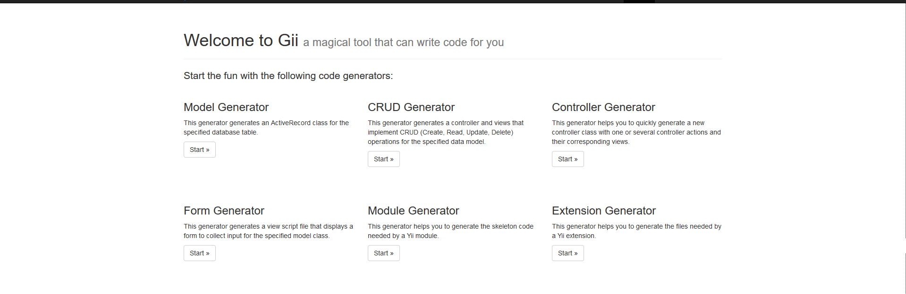
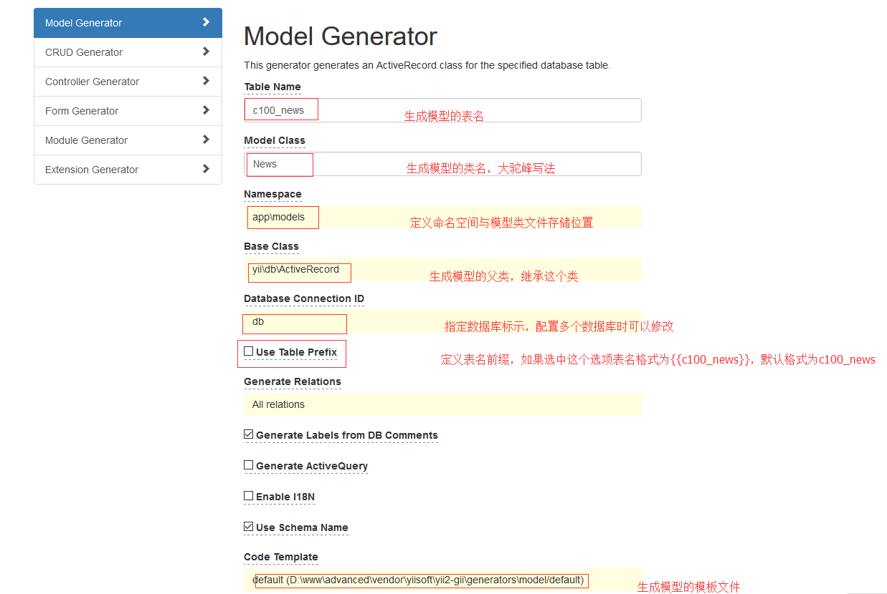
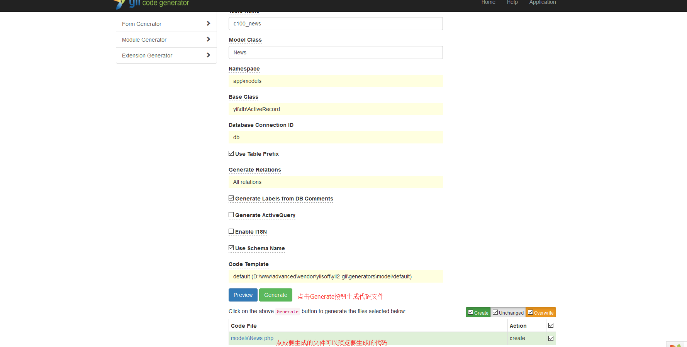
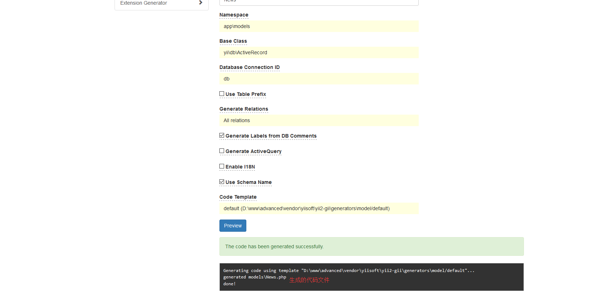
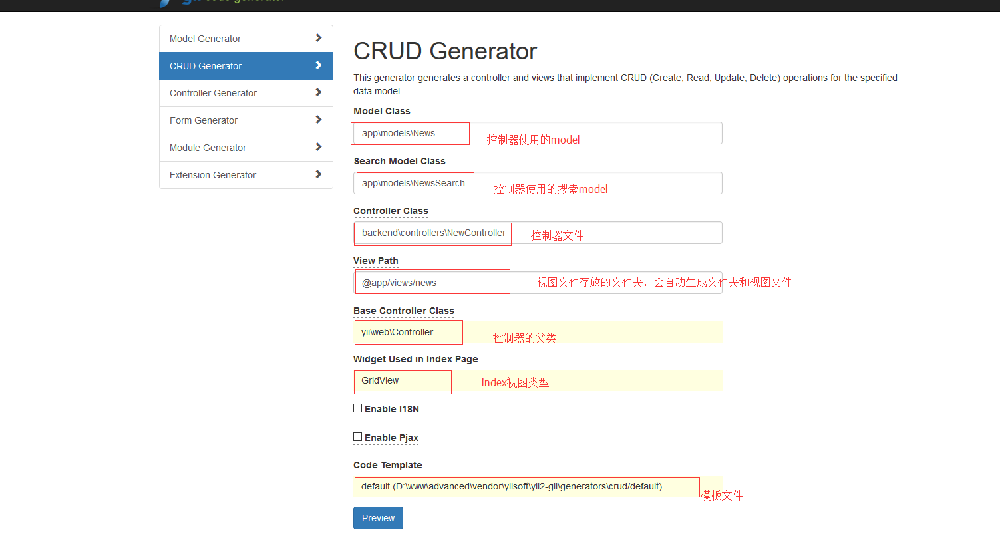
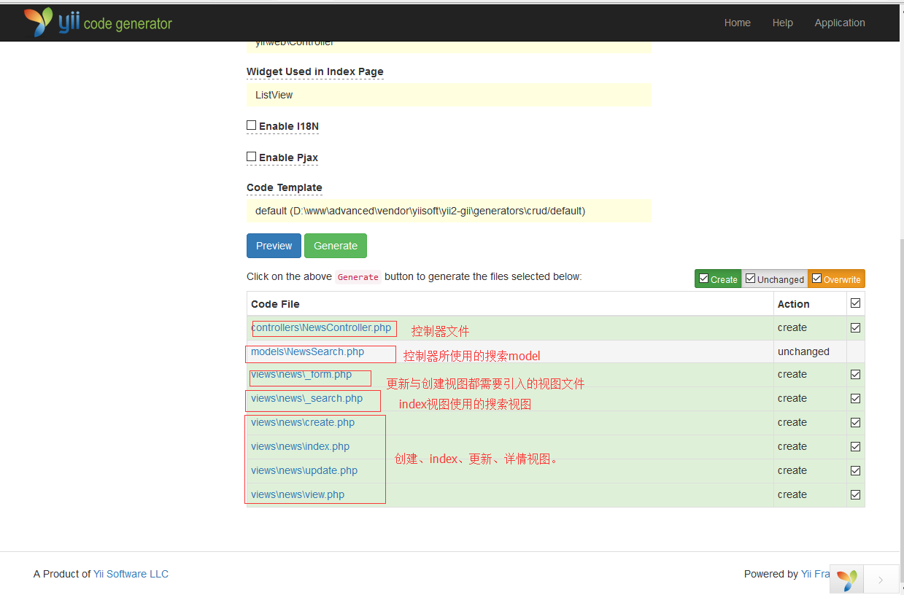
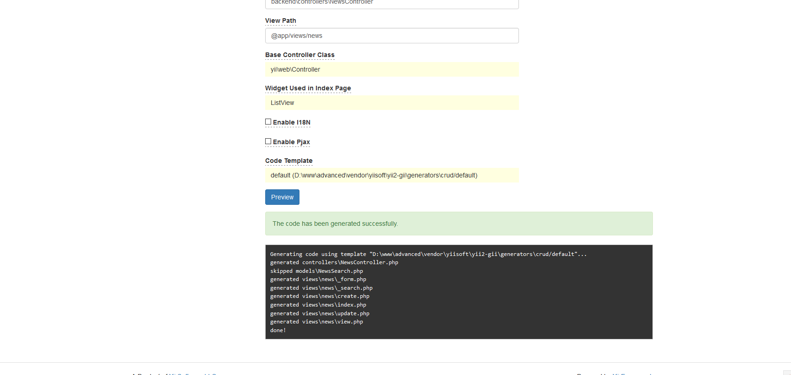

gii是yii框架里面一个很好用的工具，你可以通过url/gii来使用它

<!-- more --> 

##	配置

Gii模块只能在开发模式下使用，默认开启，但是限制访问gii模块必须是本地请求，以下配置中的allowedIPs可以自定义可以请求使用Gii模块的ip或者ip段。

##	访问Gii模块

没有开启url重写，访问地址： 
http://url/index.php/gii 
开启url重写，访问地址应该如下（根据url访问规则而定）： 
http://url/gii 
如图：

##	Gii生成model

点击Model Generator部分的start按钮，进入生成Model页面。 
填写一下信息，如图：

点击Preview按钮，进入以下页面：

完成页面：

##	Gii生成CURD

如图:

点击Preview按钮，进入以下页面：

完成页面：

